# Overview
This React app allows users to create, read, update, and delete communities, discussions, events, and nested comments.

This app is made with React.js, Apollo GraphQL, Apollo Client, and Dgraph. 

The application state is handled with the Apollo cache, which precludes the need for Redux or React Context in this particular case.

When I started this project, I used this Dgraph tutorial as a guide:
https://dgraph.io/docs/graphql/todo-app-tutorial/todo-overview/

# Screenshots

## Communities
This app lets you create Reddit-style communities that each have a unique description and purpose. Discussions and events can be created within the communities.

### List Communities 
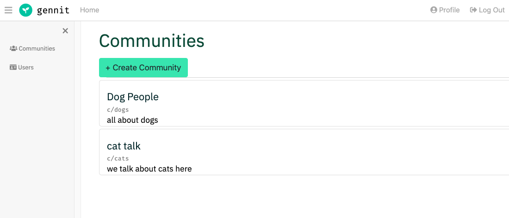

### Create Community
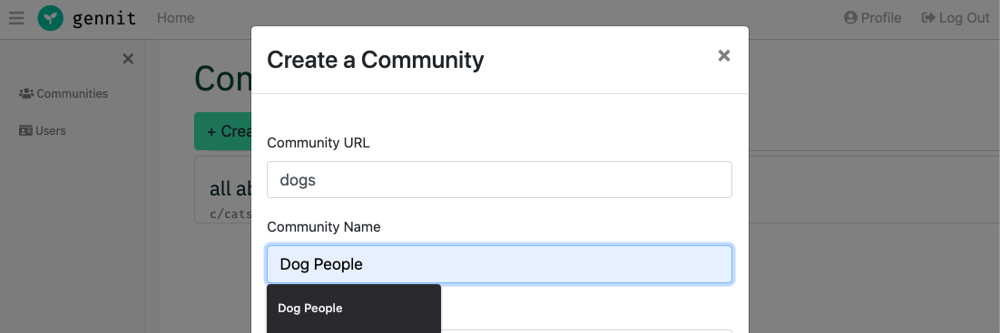

### Edit Community Details
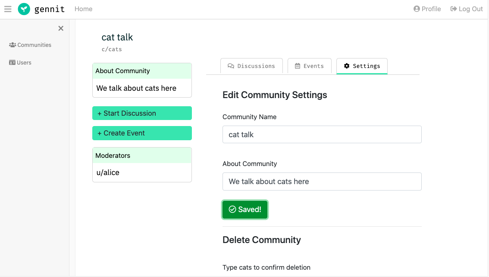

### Delete Community
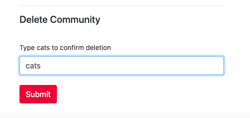

## Discussions

### List Discussions
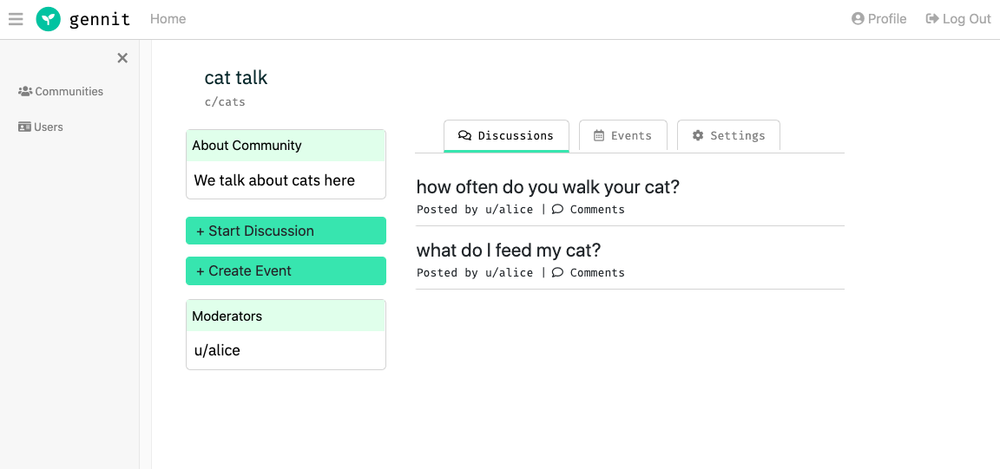

## Events
Events can be virtual or in person.

### List Events
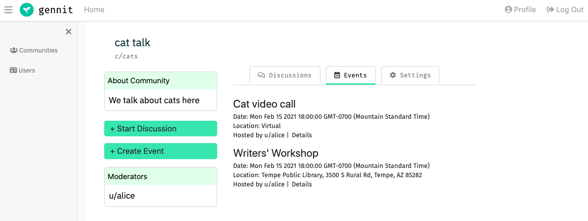

### Create Event and Set Date
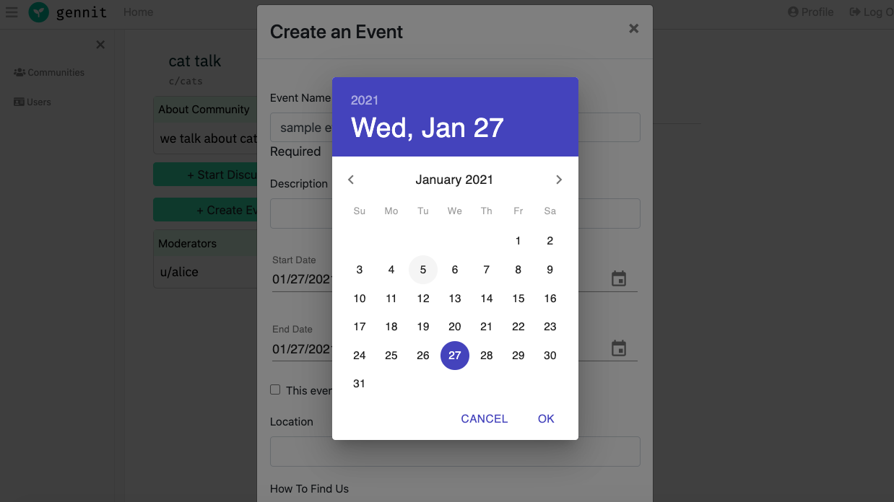

### Virtual Event Details
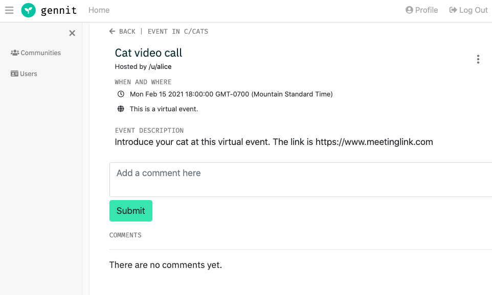

### In-person Event Details
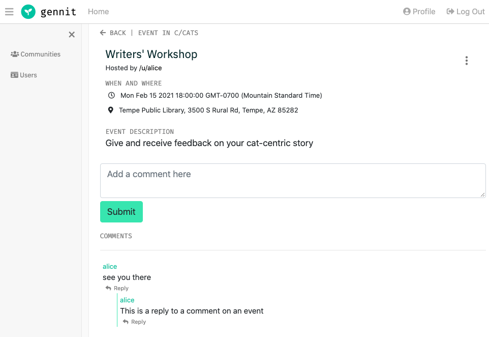

## Comments

Comments can be posted on both events and discussions. 

### Reply to Comments
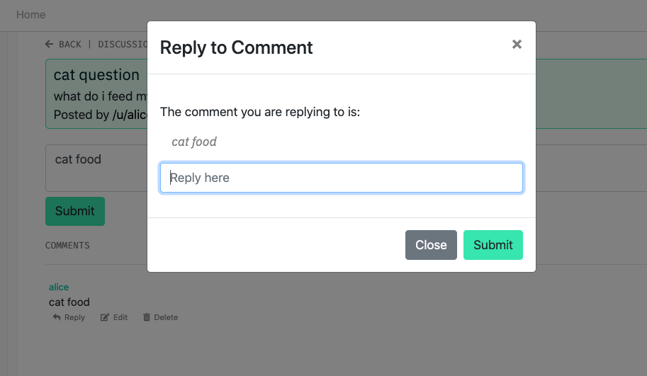

### Nested Replies
Comments can be nested to an unlimited depth.

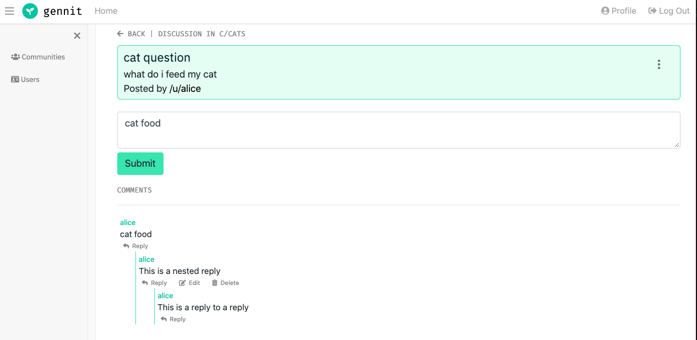


# Setup

The following is an outline of how I got this app running for development purposes:

### 1. Set up authentication

To enable authentication, I followed this procedure to set up authentication with Auth0:

https://dgraph.io/docs/graphql/todo-app-tutorial/todo-auth0-jwt/

I added the authentication information to the last line of the `schema.graphql` according to the steps on that page.

### 2. Set up database

To set up the database, I go the root directory, which contains `docker-compose.yml`, and run:

```
docker-compose up
```


### 3. Apply the schema

The database schema is in `schema.graphql`. To initialize the types in the database, or to update the schema with any changes, I run:

```
curl -X POST localhost:8080/admin/schema --data-binary '@schema.graphql'
```


### 4. Create a test user

I haven't finished the authentication functionality of this app. So to test other features in the app, I start by creating a sample user (along with other test data) in Insomnia.

I do a POST request to http://localhost:8080/graphql with the following GraphQL mutation attached:

```
mutation {
  addUser(input: [
    {
      username: "alice",
      email: "alice@gmail.com"
      name: "Alice",
    }
  ]) {
    user {
      username
      name
      email
    }
  }
}
```

### 5. Run the React app

```
npm install
npm start
```

Then I use the sample user to create, update, and delete items in the UI.